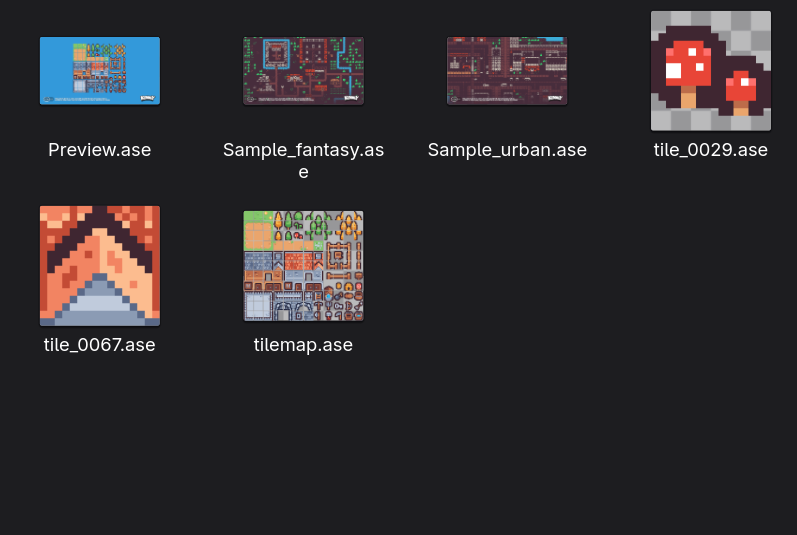

# ase-thumbnailer for GNOME

**See previews of your [Aseprite](https://www.aseprite.org) files in GNOME Files (Nautilus).**

> Made for **GNOME**. KDE (Dolphin) is **not** supported. For KDE, use [aseprite-thumbnails-kde](https://github.com/Owlmate-Julius/aseprite-thumbnails-kde) instead. Other file managers that read `.thumbnailer` files (Nemo, Caja, Thunar) might work, but are untested.

By default, GNOME Files shows `.aseprite` and `.ase` files as a generic icon. With this installed, you see the actual artwork instead, just like with PNG files:

<p align="center">
  
  <br>
  <sub>Sprites in the screenshot by <a href="https://kenney.nl/">Kenney</a>.</sub>
</p>

- **Works with any Aseprite install:** Steam, Flatpak or a plain folder. Aseprite doesn't even need to be installed.
- **Pixel art stays crisp:** no blurry scaling.
- **Nothing extra to install:** it only needs Python, which comes with most Linux systems.

> **Note:** This project was written entirely by an AI, Claude Opus 5.5 by Anthropic. Its output was checked against Aseprite's own export (see [Accuracy](#accuracy)).

## Install

```bash
git clone https://github.com/<your-user>/ase-thumbnailer.git
cd ase-thumbnailer

sudo install -Dm755 ase-thumbnailer /usr/local/bin/ase-thumbnailer
sudo install -Dm644 ase-thumbnailer.thumbnailer /usr/local/share/thumbnailers/ase-thumbnailer.thumbnailer
sudo install -Dm644 aseprite.xml /usr/local/share/mime/packages/aseprite.xml
sudo update-mime-database /usr/local/share/mime

rm -rf ~/.cache/thumbnails/fail   # retry files that previously had no preview
nautilus -q                       # restart Files
```

Then open a folder with Aseprite files in Files.

<details>
<summary>What do these commands do?</summary>

- `ase-thumbnailer` is the program that creates the previews. It has to be below `/usr` because GNOME runs thumbnailers in a sandbox that can't see anything else.
- `ase-thumbnailer.thumbnailer` tells the file manager to use it for Aseprite files.
- `aseprite.xml` teaches the system the `image/x-aseprite` file type, which most distributions don't know yet.
</details>

If previews still don't show up, check that the file type is detected:

```bash
xdg-mime query filetype some-file.aseprite   # should print image/x-aseprite
```

## Uninstall

```bash
sudo rm /usr/local/bin/ase-thumbnailer
sudo rm /usr/local/share/thumbnailers/ase-thumbnailer.thumbnailer
sudo rm /usr/local/share/mime/packages/aseprite.xml
sudo update-mime-database /usr/local/share/mime
rm -rf ~/.cache/thumbnails
```

## Requirements

- Python 3.8 or newer at `/usr/bin/python3` (preinstalled on Fedora, Ubuntu and most other distributions)
- GNOME with GNOME Files (Nautilus). Tested on Fedora with GNOME.

---

## Technical details

### How it works

The thumbnailer reads the Aseprite file format directly, using only the Python standard library, and renders the first frame the way Aseprite 1.3 does:

- RGBA, grayscale and indexed color modes (including the transparent color index and background layers)
- layer and cel opacity, hidden layers and groups
- all 19 blend modes
- tilemap layers (including flipped tiles)
- cel z-index

Large sprites are shrunk and small sprites are enlarged by a whole-number factor, both with nearest-neighbor sampling.

### Why not just call `aseprite --batch`?

GNOME runs thumbnailers inside a [bubblewrap](https://github.com/containers/bubblewrap) sandbox that can only see `/usr` and the file being thumbnailed. Thumbnailers that shell out to `aseprite` fail as soon as Aseprite lives anywhere else, for example in `~/.local/share/Steam/`. Reading the file directly avoids that, is faster than starting Aseprite for every file, and parses untrusted files in a memory-safe language.

### Accuracy

Output is verified pixel-exact against Aseprite 1.3.18's own PNG export for 146 files: real-world artwork plus generated files covering every feature listed above.

### Limitations

- Only the first frame is rendered.
- Group opacity and group blend modes are ignored, matching how Aseprite 1.3 renders them.
- Tilesets stored in external files are not loaded. Those tiles stay transparent.
- Non-square pixel aspect ratios are ignored.

### Safety

- No network access, no external programs, only the Python standard library.
- Files are only read, never modified.
- Limits on image dimensions and decompressed data size protect against malformed or malicious files (for example zip bombs).
- On GNOME it additionally runs inside the bubblewrap sandbox described above.

### Manual use

```bash
ase-thumbnailer -i sprite.aseprite -o preview.png -s 256   # fit into 256×256
ase-thumbnailer -i sprite.aseprite -o full.png             # original size
```

The exit code is non-zero if the file cannot be read, so the file manager marks it as failed instead of showing a broken image.

## License

MIT, see [LICENSE](LICENSE). File format reference: [Aseprite file specification](https://github.com/aseprite/aseprite/blob/main/docs/ase-file-specs.md).
